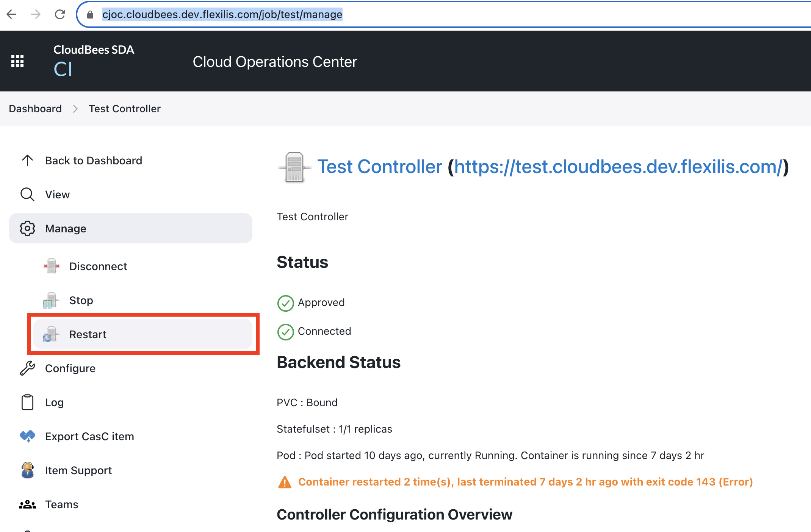
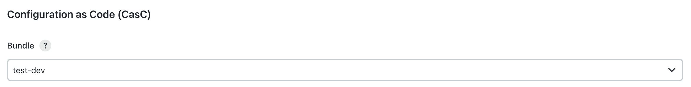

**Table of Contents**

- [Reviewing Logs](#reviewing-logs)
- [Cloudbees Services](#cloudbees-services)
- [Operational Tasks](#operational-tasks)
    - [Setup](#setup)
    - [Maintenance & Upgrades](#maintenance--upgrades)
    - [Updating builder AMIs to the latest:](#updating-builder-amis-to-the-latest)
    - [Restarting a controller](#restarting-a-controller)
    - [Opening a controller shell](#opening-a-controller-shell)
    - [Generating a service account kube-config](#generating-a-service-account-kube-config)
    - [Creating a snapshot of a controller EBS Volume](#creating-a-snapshot-of-a-controller-ebs-volume)
    - [Snapshot All client controllers](#snapshot-all-client-controllers)
    - [Moving Physical Volumes (PV) to a new namespace](#moving-physical-volumes-pv-to-a-new-namespace)
    - [Generating a new API token for FA users](#generating-a-new-api-token-for-fa-users)
    - [Assigning a CasC bundle to a Client Controller](#assigning-a-casc-bundle-to-a-client-controller)
- [Errors Commonly Found in the Logs](#errors-commonly-found-in-the-logs)
- [Issues](#issues)
    - [InvalidVolume.ZoneMismatch](#invalidvolumezonemismatch)
    - [Volume is already exclusively attached to one node](#Volume-is-already-exclusively-attached-to-one-node)
    - [A healthy, running controller returns a 404](#a-healthy-running-controller-returns-a-404)
    - [Mailer Auth Failure](#mailer-auth-failure)
    - [RBAC: user can't modify jobs](#rbac-user-cant-modify-jobs)
    - [CasC bundle is not in the List of Bundles Available for the Team Controller](#casc-bundle-is-not-in-the-list-of-bundles-available-for-the-team-controller)
    - [Broken Plugins](#broken-plugins)
</br>
</br>
</br>
</br>
</br>


# Reviewing Logs

## ELK

Cloudbees logs are sent to the Lookout ELK service described below.

...

### Controller Logs

Logs for a given controller can be viewed by adding filters for `kubernetes.namespace` and `kubernetes.pod.name`.

...

## Kubernetes

### Container logs:

    kubectl -n cloudbees-${ENVIRONMENT} logs ${CONTROLLER_NAME}-0

### K8S Resources:

    kubectl -n cloudbees-${ENVIRONMENT} describe sts ${CONTROLLER_NAME}
    kubectl -n cloudbees-${ENVIRONMENT} describe pod ${CONTROLLER_NAME}-0


----


# Cloudbees Services

## Operations Center

The operations center is deployed using the cloudbees-core helm chart located in the eks-helm-bootstrap repository.  The helm charts create a StatefulSet and Pod for the operations center called `cjoc`.  To access the pod run:

    kubectl -n cloudbees-${ENVIRONMENT} exec -it cjoc-0 bash

### Operations Center CasC

To inspect the Operations Center CasC config files available inside the container go to:

    cd /var/jenkins_config/oc-casc-bundle

The contents of the directory will look something like this:

    bash-4.4$ ls -asl
    total 12
    4 drwxrwsrwx. 3 root jenkins 4096 Jun 25 20:49 .
    4 drwxr-xr-x. 4 root root    4096 Jun 25 06:09 ..
    4 drwxr-sr-x. 2 root jenkins 4096 Jun 25 20:49 ..2023_06_25_20_49_32.872826600
    0 lrwxrwxrwx. 1 root jenkins   31 Jun 25 20:49 ..data -> ..2023_06_25_20_49_32.872826600
    0 lrwxrwxrwx. 1 root jenkins   18 Jun 25 06:08 bundle.yaml -> ..data/bundle.yaml
    0 lrwxrwxrwx. 1 root jenkins   18 Jun 25 06:08 clouds.yaml -> ..data/clouds.yaml
    0 lrwxrwxrwx. 1 root jenkins   17 Jun 25 06:08 items.yaml -> ..data/items.yaml
    0 lrwxrwxrwx. 1 root jenkins   19 Jun 25 06:08 jenkins.yaml -> ..data/jenkins.yaml
    0 lrwxrwxrwx. 1 root jenkins   19 Jun 25 06:08 plugins.yaml -> ..data/plugins.yaml
    0 lrwxrwxrwx. 1 root jenkins   16 Jun 25 06:08 rbac.yaml -> ..data/rbac.yaml
    0 lrwxrwxrwx. 1 root jenkins   17 Jun 25 06:08 tests.yaml -> ..data/tests.yaml

This directory is a volume mount of the oc-casc-bundle config map created before deploying the OC helm charts.  The config map is generated in terraform to deploy new config changes.

If a new version of the CasC bundle is detected it will be loaded into service CasC directory in `/var/jenkins_home/core-casc-bundle`.

### Controller CasC Bundles

The CasC bundles for the Client Controllers can be found in `/var/jenkins_home/cb-casc-bundles-store` in the running environment.  They are checked out from the [cloudbees-controller-casc](https://github.com/lookout-life-org/cd-cloudbees-controller-casc.git) repository on a 120 second interval.

#### RBAC

Each bundle an (inherited) rbac.yaml configuration file.  RBAC policies are made up of roles and group definitions.

Roles:
* Cannot be overridden by inheritance
* apply a list of jenkins permissions described by name
* We provide a common set of roles in the base bundle

Groups:
* Can be overridden
* Composed of other cloudbees group definitions, external groups, or users.
* Can be assigned one or more roles.

### Controller Provisioning

Client controllers are defined in the OC CasC bundle items.yaml (generated from the controller definition in Terraform).  Controller are provisioned using a Kubernetes cluster endpoint definition (as defined in the OC CasC bundle jenkins.yaml).  There are currently three endpoints:

* default - the credentials/namespace used by the OC
* environment - an endpoint named for the environment (e.g. "dev") which is used to deploy client controllers in the cloudbees-${CI_ENVIRONMENT}-controllers namesapce

Each endpoint config uses a secret (mapped through the CSI driver into the OC credential store) named `eks-dev-credentials`.  These secrets are encrypted using the OC master key and stored in the appropriate secret manager secret.  The value of the secret is the contents of a kube-config file generated from the `cjoc` service account defined in the target namespace (e.g. cloudbees-staging-controllers/cjoc).  This allos the Operations Center to connect to the Kubernetes API as the cjoc service account and provision controllers in the target namespace.

#### Validate Controller Provisioning

To verify the endpoint configuration is working go to (for the respective environment):

https://cjoc.cloudbees.dev.fsecure.com/manage/masterProvisioning/

Click the *Validate* button at the bottom of each endpoint config.  If successful it will respond with:

    Successfully connected to https://XXXXXXXXXXXXXXXXXXXXXXXXXXXXXXXX.gr7.us-west-2.eks.amazonaws.com/ namespace cloudbees-dev-controllers

If there is a network issue and cannot connect:

    Error connecting to : java.io.IOException: connect timed out

If it cannot authenticate you might need to fix the eks-dev-credentials secret.  You can do this temporarily by updating the value of the credential through the UI (replace the file).


----


# Operational Tasks

Most common tasks are added to the project [Makefile](Makefile)

## Setup

### Generate API tokens for each environment.

In the **API Token** section of your profile configuration page you can generate a new token.

https://cjoc.cloudbees.dev.fsecure.com/user/matthew.rich@fsecure.com/configure

Copy the token value and store it in a file named `$HOME/.jenkins-cb-${ENVIRONMENT}-cli` with the username:password format.

    echo "matthew.rich@fsecure.com:XXXXXXXXXX" > $HOME/.jenkins-cb-${ENVIRONMENT}-cli
    chmod 600 $HOME/.jenkins-cb-${ENVIRONMENT}-cli

### Test the token

    make ENVIRONMENT=dev list-masters

Results

    java -jar jenkins-cli.jar -noCertificateCheck -s https://cjoc.cloudbees.dev.fsecure.com/ -auth matthew.rich@fsecure.com:XXXXXXXXXX list-masters | jq -r '.data.masters[] | select(.status == "ONLINE") | .url' > cloudbees-masters-dev.txt
    Error: flags cannot be placed before plugin name: -n
    Aug 23, 2023 12:18:31 PM hudson.cli.CLI _main
    INFO: Skipping HTTPS certificate checks altogether. Note that this is not secure at all.
    cat cloudbees-masters-dev.txt
    Error: flags cannot be placed before plugin name: -n
    https://cd.cloudbees.dev.fsecure.com/
    https://common.cloudbees.dev.fsecure.com/
    https://csrv.cloudbees.dev.fsecure.com/
    https://test.cloudbees.dev.fsecure.com/

### Login

To ensure you have access to all the AWS profiles required by Terraform can run the login target.

#### To run plans for the Dev environment you should go to the fsecure_dev account directory and run the login target, followed by init, plan, apply if applicable.

    cd terraform/accounts/fsecure_dev
    make ENVIRONMENT=dev login


## Maintenance & Upgrades

When performing maintenance on a Cloudbees environment it is recommended to ensure recent snapshots have been created for each of the EBS volumes provisioned for the pods prior to performing the maintenance.  This can be accomplished by running the create-snapshot target for [all controllers](#snapshot-all-client-controllers).

Upgrades must be deployed on the Operations Center first, followed by restarting each of the client controllers once the OC is running the new version.  Creating a [snapshot of the Operations Center](#snapshot-operations-center) should be performed first.

## Updating builder AMIs to the latest:

    make ENVIRONMENT=dev update-ami-secrets

## Restarting a controller

To kill a controller and cause it to restart with the running configuration you can remove the pod:

    kubectl -n cloudbees-dev delete pod test-0

To restart the controller with the configuration defined in the operations center restart the controller through the UI.  This will remove the Kubernetes resources (Pod, StatefulSet, etc) and re-create them.  This distinction is meaningful in the situation where the configuration in the OC is different than that running in Kubernetes.  For instance, CasC changes that have been applied in the OC but the controllers have not been restarted or changes that were made to the controller through the UI but don't exist in CasC or changes that may have been made directly to the K8S resources.

    https://cjoc.cloudbees.dev.fsecure.com/job/test/manage



## Opening a controller shell

    kubectl -n cloudbees-dev exec -it cd-0 bash

## Generating a service account kube-config

    make ENVIRONMENT=staging CONTROLLER=eks_fsecure_dev create-cluster-kube-config

Generates a kube-config file named `kube-config.$(ENVIRONMENT)` for the cjoc service account in the the cloudbees-${ENVIRONMENT}-controllers namespace.  The kube-config file should be stored in a jenkins credential of type file loaded through the kubernetes secret provider class.  See the operations center CasC for examples.

### Testing the service account kube-config

    kubectl --kubeconfig ./kube-config.dev get pods

## Creating a snapshot of a controller EBS Volume

Ensure the cluster context is set correctly

    kubectl config use-context arn:aws:eks:us-west-2:XXXXXXXXXXXX:cluster/eks_fsecure_dev

### Snapshot Operations Center

    make ENVIRONMENT=dev CONTROLLER=cjoc create-snapshot

### Snapshot CD client controller

    make ENVIRONMENT=dev CONTROLLER=cd NAMESPACE=cloudbees-dev-controllers create-snapshot

## Snapshot All client controllers

    make ENVIRONMENT=dev TARGET=create-snapshot NAMESPACE=cloudbees-dev-controllers run-target

## Moving Physical Volumes (PV) to a new namespace

* Ensure the PV reclaim policy is set to Retain

    kubectl patch pv pvc-346c5641-81d7-4465-b772-f015b853f47e -p '{"spec":{"persistentVolumeReclaimPolicy":"Retain"}}'
    kubectl get pv pvc-346c5641-81d7-4465-b772-f015b853f47e

* Stop any pods using the Persistent Volume Claim (PVC) associated with the PV

* Get the yaml description of the PVC definition
    kubectl -n my-source-namespace get pvc my-pvc-name -o yaml > my-pvc-name.yaml

* Edit the yaml document to remove generated metadata and change the namespace.  It might look something like the following.

        apiVersion: v1
        kind: PersistentVolumeClaim
        metadata:
          name: ${PVC_NAME}
          labels:
            com.cloudbees.cje.tenant: ${CONTROLLER_NAME}
            com.cloudbees.cje.type: master
            com.cloudbees.pse.tenant: ${CONTROLLER_NAME}
            com.cloudbees.pse.type: master
            tenant: ${CONTROLLER_NAME}
            type: master
        spec:
          accessModes:
            - ReadWriteOnce
          storageClassName: ebs-sc
          resources:
            requests:
              storage: ${STORAGE_SIZE}Gi
          storageClassName: ebs-sc
          volumeMode: Filesystem
          volumeName: ${PV_NAME}


* Delete the PVC associated with your PV in the original namespace

* Remove the claimRef from the PV
    kubectl patch pv pvc-346c5641-81d7-4465-b772-f015b853f47e  --type json -p '[{"op": "remove", "path": "/spec/claimRef"}]'

* Create a new PVC in the target namespace using the edited yaml document of the orginal PVC definition.

## Generating a new API token for FA users

For example to generate a new API token for fa.cloudbees:

* login to fsecure.okta.com admin console and find the fa.cloudbees user and reset the MFA
* get fa.cloudbees password from cerberus continuous delivery/jenkins-master
* open chrome incognito and login using fa.cloudbees credentials on fsecure.okta.com
* configure the MFA with your device
* go to the cloudbees app
* go to the user profile configure page
* generate a new api token for the fa.cloudbees user
* save the new token in cerberus and in secrets manager (fedsecrets_prod account) fa.cloudbees keys https://us-west-2.console.aws.amazon.com/secretsmanager/secret?name=cd%2Fspinnaker&region=us-west-2
* terminate the igor instances for igor-prod-app one at a time https://spinnaker/#/projects/spinnaker/applications/igor/clusters

## Assigning a CasC bundle to a Client Controller

The [Client Controller CasC bundle setting](terraform/modules/cloudbees_oc_casc_configmap/main.tf#L140) for each controller is part of the generated items in the Operations Center CasC.  The default value is set to `${controller_name}-${CI_ENVIRONMENT}` (E.g. cd-dev).  To change this value at run-time you can update the value in the configuration page of a given controller: https://cjoc.cloudbees.dev.fsecure.com/job/test/configure



Once you select the desired CasC bundle from the drop-down you can save the change to the controller.  To ensure the new CasC bundle is applied you may need to restart the controller.  

----


# Errors Commonly Found in the Logs

## Secrets Manager can't find the specified secret.

    2023-04-12 01:31:43.807+0000 [id=33]    INFO    i.j.p.c.s.AwsSecretsManagerSecretSource#reveal: Secrets Manager can't find the specified secret. (Service: AWSSecretsManager; Status Code: 400; Error Code: ResourceNotFoundException; Request ID: d2a5461e-912c-4628-af1a-647cfd13b036; Proxy: null)

This is usually thrown because the CasC bundles refer to secrets that may not exist and it can be ignored when those variables are provided with a default value.  If there is no default value in the CasC and the secret resolution fails then it may cause the controller to stop.

#### Resolution

Ignore it, or if the controller is failing to start create the missing secret or provide a default value.

## No signature block found in update site

    2023-04-12 01:32:01.637+0000 [id=33]    SEVERE  hudson.model.UpdateSite#updateData: ERROR: No signature block found in update site &#039;core-mm-offline&#039;

This seems to be an intermittent error.  It appears to be related to an error with fetching metadata from the Cloudbees Update Center.  It does not appear to cause any problems at this point and when refreshed through the UI it seems to go away after some time.

#### Resolution

None at this time.  Needs more investigation.  No immediate issue.


----


# Issues

## FR controller has broken domain: https://subdomain.cloudbees.fr.fsecure.com

When hot-reloading the CasC on a client controller in FR it occasionally causes the domain to change to: https://name.cloudbees.fr.fsecure.com rather than https://cloudbees-fr.production.fsecure.com/name

This seems like it might be a bug in Cloudbees since the URL is generated by the operations center based on the controller configuration.  For some reason when the CasC reloads on the controller the operations center generates a subdomain-based URL.  There might be some default or missing configuration that is overwriting the domain setting when the process runs a hot reload.

#### Resolution

Restarting the controller resolves this issue.

## InvalidVolume.ZoneMismatch

    [Tue Jul 25 21:51:36 UTC 2023][Warning][Pod][csrv-0][FailedAttachVolume] AttachVolume.Attach failed for volume "pvc-a03e48b4-38cb-4e6e-b875-1dfacd1c3d67" : rpc error: code = Internal desc = Could not attach volume "vol-4de0dfc562a1423d9" to node "i-48d17a64dc2848329": could not attach volume "vol-4de0dfc562a1423d9" to node "i-48d17a64dc2848329": InvalidVolume.ZoneMismatch: The volume 'vol-4de0dfc562a1423d9' is not in the same availability zone as instance 'i-48d17a64dc2848329'

#### Resolution

In order to move a PV to another zone it is necessary to create a snapshot of the volume and create a new PVC based on the snapshot (which will generate a new PV in the correct AZ).  Since this is an involved process a better solution might be to force the controller to schedule on a node that is in the correct AZ.

* Lookup the AZ for the given volume (E.g. us-west-2a)
* Add a nodeSelector to the controller configuration for the given zone.

In the YAML section of controller configuration page https://cjoc.cloudbees.dev.fsecure.com/job/csrv/configure
insert the following in the controller container template:

    nodeSelector:
      topology.kubernetes.io/zone: us-west-2a

The beginning of the manifest looks like the following:

    ---
    apiVersion: "apps/v1"
    kind: "StatefulSet"
    spec:
      template:
        metadata:
          labels:
            filebeat-index: eks-cloudbees
        spec:
          serviceAccountName: "csrv"
          nodeSelector:
            topology.kubernetes.io/zone: us-west-2a

## Volume is already exclusively attached to one node

    [Fri Sep 01 16:55:21 UTC 2023][Warning][Pod][aps-0][FailedAttachVolume] Multi-Attach error for volume "pvc-54dcdc0a-8ed0-46c2-b423-fddf34bc30bb" Volume is already exclusively attached to one node and can't be attached to another

#### Resolution

As with the [InvalidVolume.ZoneMismatch](#invalidvolumezonemismatch) error the scheduler is unable to place the pod on the correct node.  To force the scheduler to use a specific node you can try a hostname nodeSelector:

    nodeSelector:
      kubernetes.io/hostname: ip-10-1-1-1.us-west-2.compute.internal


## A healthy, running controller returns a 404

    This common.cloudbees.dev.fsecure.com page can’t be found
    No webpage was found for the web address: https://common.cloudbees.dev.fsecure.com/operations-center-sso-navigate/?from=/
    HTTP ERROR 404

#### Resolution

This is most often caused by incorrect DNS records created for the client controller.  The external-dns controller manages all the DNS records for the cloudbees environment.  It uses a unique ID, which is set in a TXT record along with DNS record dynamically created.  It uses this to identify which records it can manage.  As the external-dns controllers has changed it has modified what it creates in these TXT records and so has lost the ability to manage records created before the update.  These stale records often point to an ELB that doesn't exist anymore.  The best solution is to just delete the records created for the client specific client controller and allow the external-dns controller to create new records by stopping the client controller and restarting it.

## Mailer Auth Failure

The default Cloudbees email notification configuration uses our sendgrid account to deliver mail.  Unfortunately, the credentials accepted in the CasC configuration for this feature do *not* support Jenkins credentials.  The CasC configuration for the mailer expects a password field which contains the password encrypted with the master secret for that controller.  This means that the authentication would fail if this password were loaded from a common secret, either encrypted or unencrypted.  The only way to load this secret through CasC would be to create a unique secret, for each controller, with the value encrypted with the controller master key.

```
    Sending e-mails to: test@fsecure.com
    ERROR: 535 Authentication failed: Bad username / password
```

#### Resolution

We opted to remove the mailer auth configuration from CasC entirely and set the password manually.  This means that the password configuration is stateful and will persist in the controller EBS volume, but if you need to create a new controller or re-provision an existing controller from scratch that this password will need to be set manually.

There is anlternative mailer implementation that is provided through the shared library that provided the same functionality, but allows using Jenkins credentials.

## RBAC: user can't modify jobs

This is usually caused by incorrect group/role assignment on the team controller.  There are currently two levels of permissions: read-only (any authenticated user) and developer (must be a member of the developer group).  The default developer group is composed of the list of team groups described in the base CasC bundle: https://github.com/lookout-life-org/cd-cloudbees-controller-casc.git/blob/main/mes-base/rbac.yaml#L164.  The developer group is often overridden to be more restrictive in child bundles so that only certain teams have write-access to the given controller.  To diagnose permission problems you can verify what groups/users are members of the `developers` group by viewing it in the `groups` page on the respective controller (https://cd.cloudbees.staging.fsecure.com/groups/).  If the team group (E.g. okta-infosec-master) is not present then it can be added to the `mes-base` rbac.yaml `development-teams` group.  If the external group is present but crossed out in the list then it is most likely not being synced from OKTA.

#### Resolution

Ensure the OKTA/AD user group is assigned to the appropriate Cloudbees app in okta and that the same external group is present in either the mes-base/rbac.yaml `development-teams` group (which is the source of the developers group in that bundle) or in the controller-specific rbac.yaml as a member of the `developers` group.

## Broken Volume Mounts

## CasC bundle is not in the List of Bundles Available for the Team Controller

If, for example, the CD controller in the `dev` environment were configured to use the `cd-dev` CasC bundle but the controller is reporting the configured bundle as `None` and the `cd-dev` bundle is not available in the list.

#### Resolution

This could be the result of a couple of different issues.

1. The bundle needs to have the `availabilityPattern` set in correctly in the bundle.yaml.  In this case it would look like:

```
    id: "cd-dev"
    version: "3"
    apiVersion: "1"
    description: "Dev CD Controllers CasC bundle"
    parent: "cd"
    availabilityPattern: ".*"
    jcasc:
      - "jenkins.yaml"
    rbac:
      - "rbac.yaml"
```

2. The bundle is not loading correctly because of syntax errors.  Cloudbees tries to validate the bundles and it may not allow you to use a bundle that has errors.  You can check the bundle errors on the operations center here https://cjoc.cloudbees.dev.fsecure.com/core-casc-bundles/?tab=2 by clicking on the status icon for the bundle.  You may also find errors reported in the logs on the controller manage page on the operations center, for example: https://cjoc.cloudbees.dev.fsecure.com/job/common/manage

## Broken CasC Bundles

## Broken builders

## Broken Plugins

After reviewing the controller logs you see that Cloudbees is skipping or completely failing to install an existing hpi you might have to manually remove it from the controller.

After [Opening a controller shell](#opening-a-controller-shell) you can manually remove the plugin from the jenkins home.

    cd /var/jenkins_home/plugins
    rm gradle.jpi


In the event the cb-envelope configuration is broken or currupted, the suggested resolution here is to delete the `/var/jenkins_home/cb-envelope` directory.
https://docs.cloudbees.com/docs/cloudbees-ci-kb/latest/client-and-managed-masters/jenkins-fails-to-start-with-envelopeexception-error
